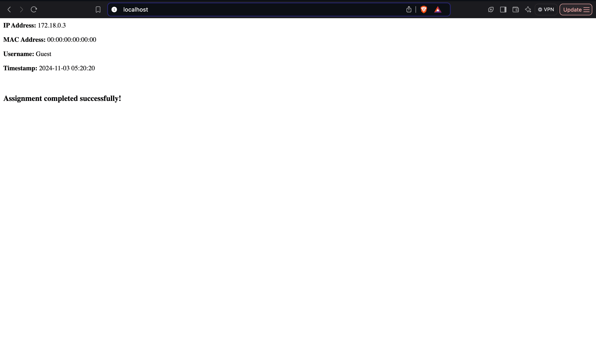
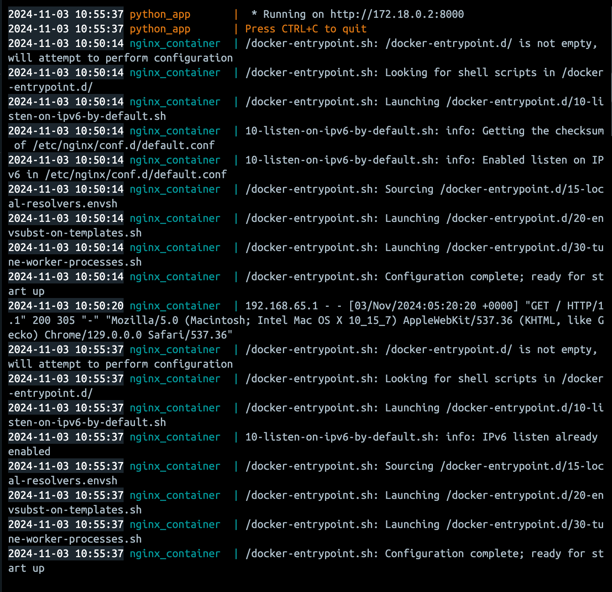

# Running Application

# Dockerized Nginx and Python Application

## Issues Identified

During the image building and container setup for the Nginx and Python applications, the following errors were encountered:

1. **Nginx Configuration Errors**: Typos and incorrect directives in the Nginx configuration file caused the server to fail to start.
2. **Dockerfile Errors**: The Dockerfiles contained obsolete attributes and incorrect command syntax that impeded successful builds.
3. **Port Definition Issues**: Incorrect port definitions and missing files prevented the applications from running correctly.

## Resolution Steps

To resolve the identified issues, the following actions were taken:

### Nginx Dockerfile Changes (`nginx/Dockerfile`)

- **Base Image**: Changed the base image declaration from:
  FROM nginx:latests
to:
  FROM nginx:latest

### Configuration File: Corrected the COPY command from:
  COPY nginix.conf /etc/nginx/nginx.conf
to:
  COPY nginx.conf /etc/nginx/nginx.conf
 
### Port Exposure: Fixed the port definition from:
  EXPOSE "eighty"
to: 
  EXPOSE 80

### HTML Directory Copy: Removed an erroneous copy command and ensured the destination was correctly specified.

### Run Command: Updated the command from:

CMD ["nginx", "-g", "daemon of;"]

to: 

CMD ["nginx", "-g", "daemon off;"]

### Nginx Configuration File Changes (nginx/nginx.conf)
Corrected Directive Names: Updated worker_process to worker_processes.

### Fixed Connection Directive:
  Changed worker_connection to worker_connections.

### MIME Types Inclusion: Changed:

include /etc/nginx/mime.typess;
 
to: 

include /etc/nginx/mime.types;

### Default Type Update: 
  Corrected default_typ to default_type.

### Python Application Changes (Python/app.py)
### Removed Unused Imports: Eliminated the unused import: import socket

Python Dockerfile Changes (Python/Dockerfile)
### Updated Base Image: Changed the base image to:
  FROM python:3.9

### Corrected Working Directory: Fixed the working directory from:
  WORKDIR /appp
to:
  WORKDIR /app

### Fixed Application File Copy: Corrected the application file copy command from:
  COPY appy.py /app
to:
  COPY app.py /app

### Package Installation Command: Updated the package installation command from:
  RUN pip install flask netiface
to: 
  RUN pip install flask netifaces

### Port Exposure: Fixed the port exposure from:
  EXPOSE "eight thousand"
to:
  EXPOSE 8000

### Run Command: Updated the run command from:
  CMD ["pythn", "app.py"]
to: 
  CMD ["python", "app.py"]

